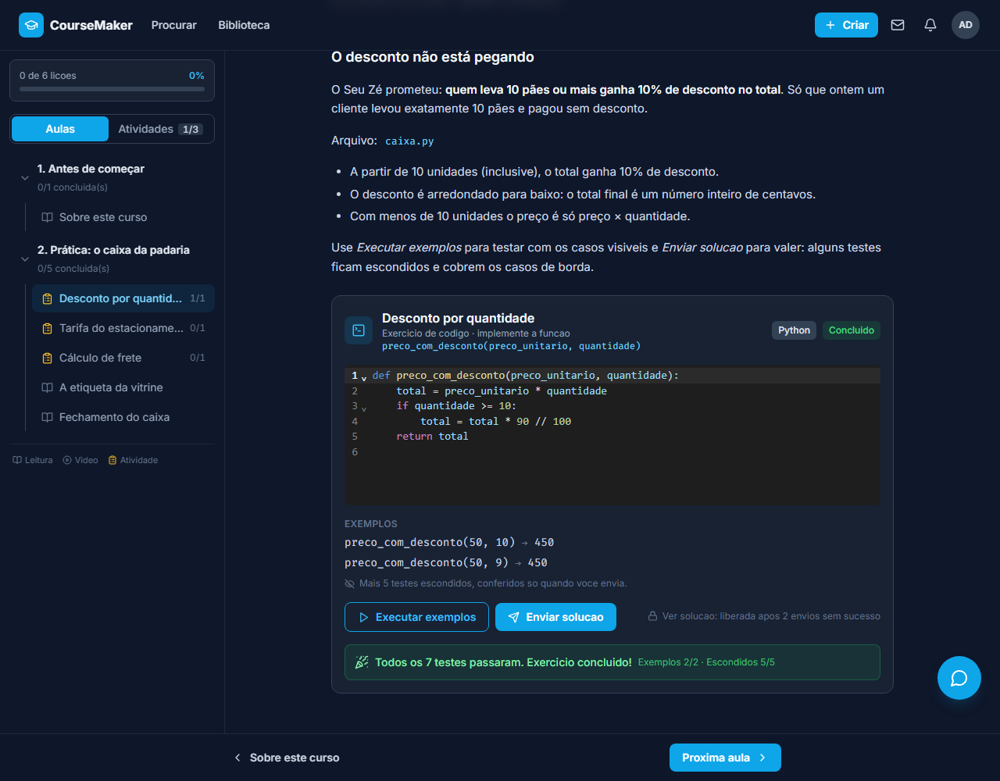
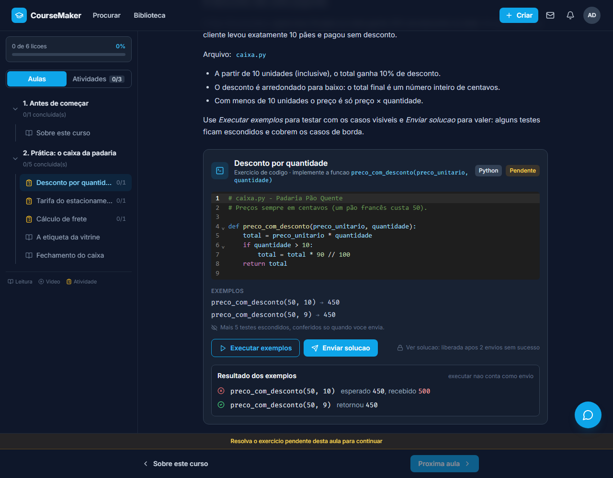
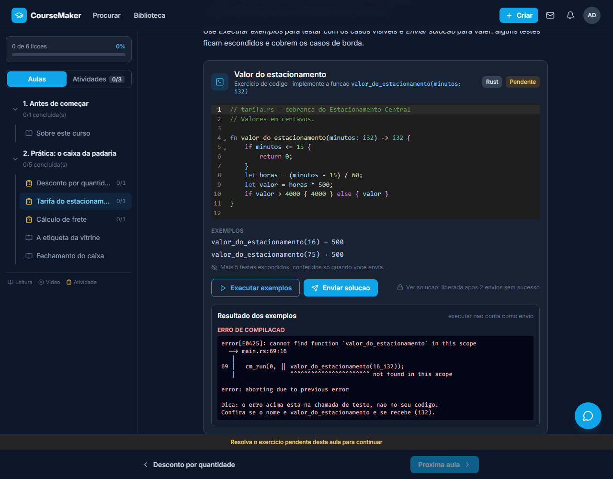
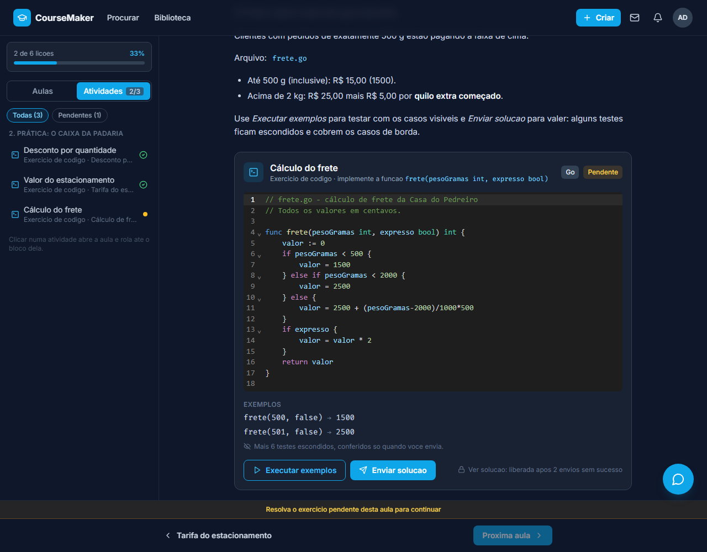
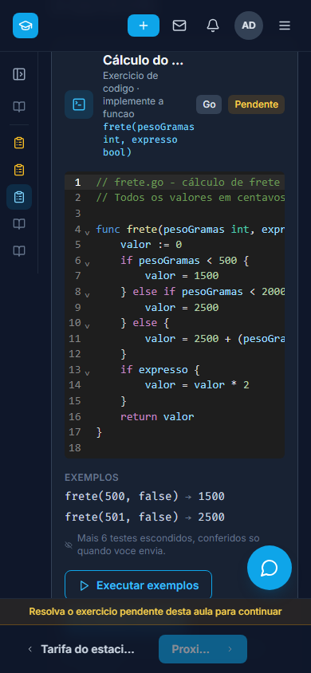
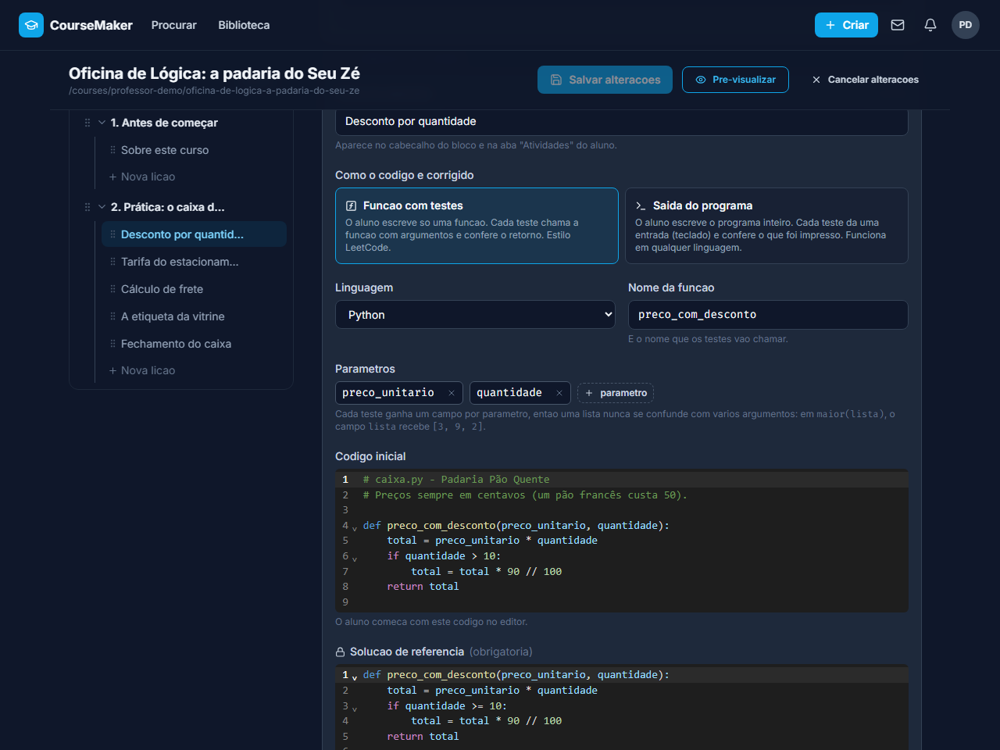
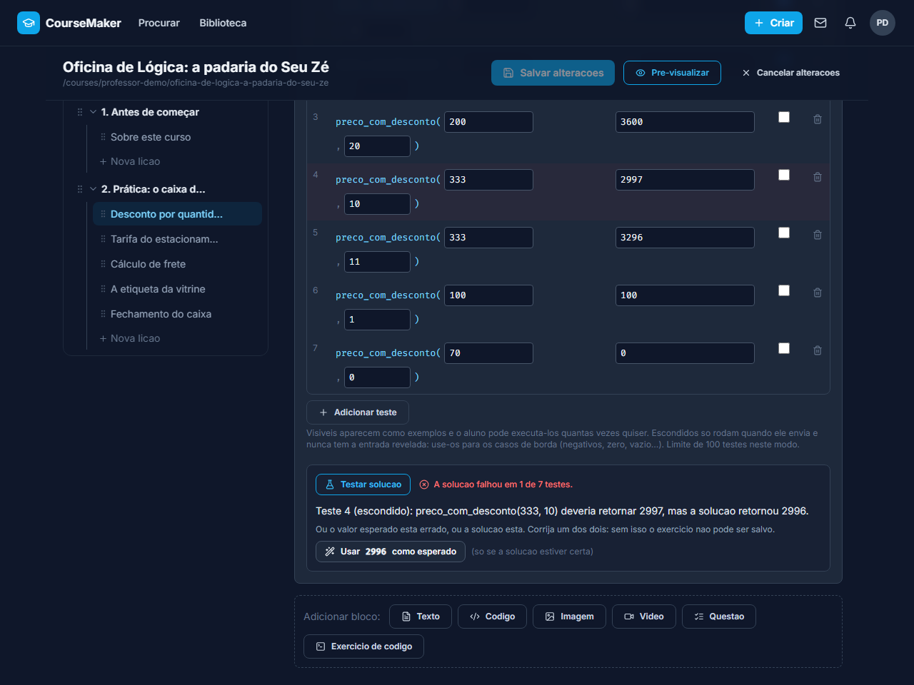
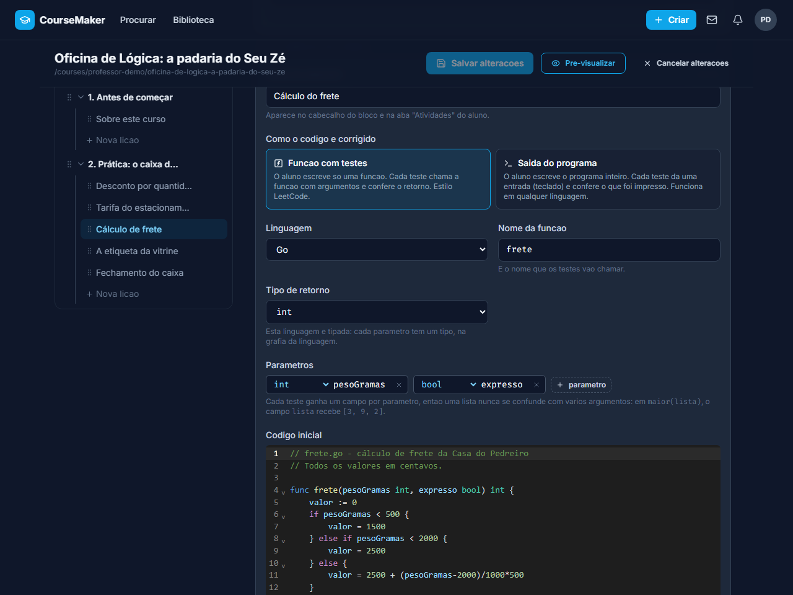

# CourseMaker

Plataforma de aprendizado aberta a qualquer pessoa: você pode ser aluno, professor, ou os dois ao
mesmo tempo. Crie e publique cursos estruturados, trilhas e posts com blocos de conteúdo rico
(texto, código, imagem e vídeo), ou simplesmente entre para aprender com o que a comunidade
publicou.

🔗 **[coursemakerbr.vercel.app](https://coursemakerbr.vercel.app/)**

## 📁 Estrutura

```
coursemaker/
├── backend/            # API REST (Java + Spring Boot)
├── web/                # SPA (React + Tailwind)
├── course-seeder-bot/  # bot Python de povoamento de conteúdo
├── piston-gateway/     # gateway (Go) na frente do Piston, p/ execução de código
└── docs/screenshots/   # imagens deste README (geradas por `npm run docs:screenshots`)
```

## ⚙️ Configuração

### 1. Banco de dados

```bash
docker run -d --name coursemaker-postgres -e POSTGRES_DB=coursemaker -e POSTGRES_USER=postgres -e POSTGRES_PASSWORD=postgres -p 5432:5432 postgres:16
```

Ou, com o PostgreSQL já instalado localmente:

```bash
createdb coursemaker
```

As tabelas são criadas pelas migrations do Flyway na primeira execução do backend.

### 2. Backend

```bash
cd backend && cp .env.example .env && mvn spring-boot:run
```

- API: `http://localhost:8080`
- Swagger UI: `http://localhost:8080/swagger-ui.html`

### 3. Web

```bash
cd web && npm install && npm run dev
```

- App: `http://localhost:5173`

O app web usa `VITE_API_URL` (padrão `http://localhost:8080`) para achar a API. O backend libera
CORS para a origem definida em `FRONTEND_URL`; os dois precisam combinar.

### 4. Conteúdo (opcional)

Com backend e web rodando, mas o banco vazio, use o [course-seeder-bot](./course-seeder-bot/README.md)
para popular a plataforma com cursos, posts e trilhas de exemplo.

## 💻 Exercícios de código (Piston)

Aulas podem ter **exercícios de código corrigidos automaticamente**, no estilo LeetCode/beecrowd: o aluno escreve a
solução num editor com realce de sintaxe, testa com os exemplos e envia; o resultado de cada teste volta na hora.

| O aluno vê o exercício e executa os exemplos | Acertou: a aula é concluída |
|---|---|
|  |  |



**Duas formas de correção**
- **Função com testes** (`function`): o aluno escreve só a função e cada teste a chama com argumentos e confere o retorno.
- **Saída do programa** (`output`): o aluno escreve o programa inteiro; cada teste dá uma entrada (stdin) e confere o que foi impresso.

**Como funciona**
- Os testes **escondidos** e a solução de referência ficam só no servidor: o aluno recebe apenas os exemplos e a
  contagem dos escondidos. A solução só é liberada depois de 2 envios sem sucesso.
- Ao salvar, o backend **roda a solução de referência contra todos os testes** (*validate on save*): um exercício que
  ninguém consegue passar é recusado com o detalhe do teste que falhou.
- Quando o exercício tem de ser resolvido, a aula só é concluída depois que ele é.
- Erros de compilação, exceções, tempo esgotado e saída excessiva aparecem para o aluno; o tempo é limitado por execução.
- Comparação de decimais com tolerância de 1e-9; números inteiros e textos comparados exatamente.



**12 linguagens**

| Modo função | Linguagens |
|---|---|
| Argumentos em JSON (dinâmicas) | JavaScript, TypeScript, Python, PHP, Ruby |
| Gateway gera o código com os tipos (tipadas) | Java, C#, C++, Go, Rust, Kotlin; C (só números e texto) |
| Modo saída | todas as 12 |

As linguagens tipadas usam um vocabulário único de tipos (`int`, `long`, `double`, `boolean`, `String`, arrays e listas), e
cada uma mostra os seus (`[]int` em Go, `Vec<i32>` em Rust, `std::vector<int>` em C++). O aluno escreve **só a função**:
o gateway acrescenta o `main`, e os números de linha dos erros batem com os do editor.

<table>
<tr>
<td width="50%"></td>
<td width="50%"></td>
</tr>
</table>

### Para quem cria o curso

O bloco **Exercício de código** tem um editor próprio: modo de correção, linguagem, nome da função, parâmetros (com tipo, nas
linguagens tipadas), código inicial, solução de referência e a tabela de testes, cada um **visível** (exemplo) ou **escondido**
(caso de borda). O botão **Testar solução** roda a solução de referência sem salvar.







### Arquitetura

```
navegador ──► backend (Spring Boot) ──► piston-gateway (Go) ──► executor
               guarda testes e solução      token Bearer             Piston (todas as linguagens)
               valida ao salvar             gera o código de teste   ou contêiner Docker / processo local
               libera só o que o aluno vê   compara os resultados    (JavaScript, Python, Java, C e C++)
```

- O **Piston não tem autenticação** e nunca fica exposto: só o gateway fala com a internet, protegido por um token compartilhado
  com o backend (`CODE_RUNNER_URL` e `CODE_RUNNER_TOKEN` no `.env` do backend; `AUTH_TOKEN` no do gateway).
- O gateway tem **três executores** (`RUNNER`): `piston` (padrão, todas as linguagens), `docker` (contêiner efêmero por execução)
  e `local` (processos no próprio contêiner, para hospedagens sem Docker, como o plano gratuito da Render, só com 5 linguagens).
  O endpoint `GET /languages` diz ao backend o que o executor em uso roda, e o seletor do criador mostra só isso.
- Detalhes, endpoints, limites e como subir em produção: **[piston-gateway/README.md](./piston-gateway/README.md)**.

### Rodando na sua máquina

```bash
cd piston-gateway && cp .env.example .env     # defina AUTH_TOKEN
docker compose up -d --build                   # sobe o Piston, instala as linguagens e abre o gateway em :8081
# no .env do backend: CODE_RUNNER_URL=http://localhost:8081 e CODE_RUNNER_TOKEN=<o mesmo AUTH_TOKEN>
cd ../course-seeder-bot && python seed_piston_demo.py   # curso de demonstração com exercícios
```

A primeira subida baixa os pacotes de cada linguagem (alguns minutos). Para ver como os exercícios foram escritos:
[course-seeder-bot](./course-seeder-bot/README.md#exercícios-de-código-nos-cursos-da-curadoria) (72 exercícios em 12 linguagens, com
código inicial de verdade e um bug típico para o aluno consertar).

### Atualizando as imagens deste README

As imagens de `docs/screenshots/` não vêm de dados reais: o Playwright intercepta toda chamada à API e responde com dados
inventados (a padaria do Seu Zé), então basta o frontend rodando.

```bash
cd web && npm run dev                          # em outro terminal
npm run docs:screenshots                       # regrava docs/screenshots (script: web/scripts/readme-screenshots.mjs)
```

## 🧪 Testes

```bash
cd backend && mvn test
```

Os testes de integração sobem um PostgreSQL 16 real e efêmero (`io.zonky.test:embedded-postgres`),
sem precisar de Docker nem do banco de desenvolvimento.

## 📖 Documentação

Cada parte do projeto tem seu próprio README, com stack, arquitetura, variáveis de ambiente e
decisões técnicas detalhadas:

- 📗 **[Backend](./backend/README.md)** — API REST em Java/Spring Boot: autenticação, endpoints,
  banco de dados, WebSocket, migrations.
- 📘 **[Web](./web/README.md)** — SPA em React/Vite: rotas, estrutura de componentes,
  variáveis de ambiente, decisões de UI.
- 🐳 **[piston-gateway](./piston-gateway/README.md)** — gateway em Go na frente do Piston: endpoints
  (`/run-tests`, `/run-output`, `/languages`), as 12 linguagens, executores, limites e produção.
- 🤖 **[course-seeder-bot](./course-seeder-bot/README.md)** — bot em Python usado para popular a
  plataforma com cursos, posts e trilhas reais, tanto gerados do zero (via LLM) quanto extraídos de
  playlists reais do YouTube com atribuição de origem.

## 🔑 Funcionalidades

- Autenticação JWT (email/senha + Google Identity Services) e recuperação de senha por e-mail
- Cursos, posts e trilhas com módulos/etapas, lições e blocos de conteúdo (texto, código, imagem,
  vídeo, quiz)
- Editor WYSIWYG para blocos de texto e syntax highlighting para código
- Conteúdo público ou privado (protegido por senha)
- Matrículas, curtidas, progresso de lições e certificado de conclusão
- Biblioteca pessoal com pastas para salvar cursos, posts e trilhas
- Mensagens diretas e notificações em tempo real (WebSocket)
- Chat com IA sobre o conteúdo de um curso ou post
- Comentários com threads e banimento por curso
- Escolas/canais de origem, com atribuição de conteúdo curado
- Exercícios de código corrigidos automaticamente, em 12 linguagens (função com testes ou saída do programa)
- Busca unificada de cursos, posts e trilhas
- Painel de administração (áreas, escolas, home, moderação de conteúdo)
- Perfis públicos de usuários
- Proteção contra força bruta no login e na senha de conteúdo privado

## 📄 Licença

[Unlicense](./LICENSE) — domínio público. Use, copie, modifique e redistribua como quiser, sem
necessidade de atribuição.
